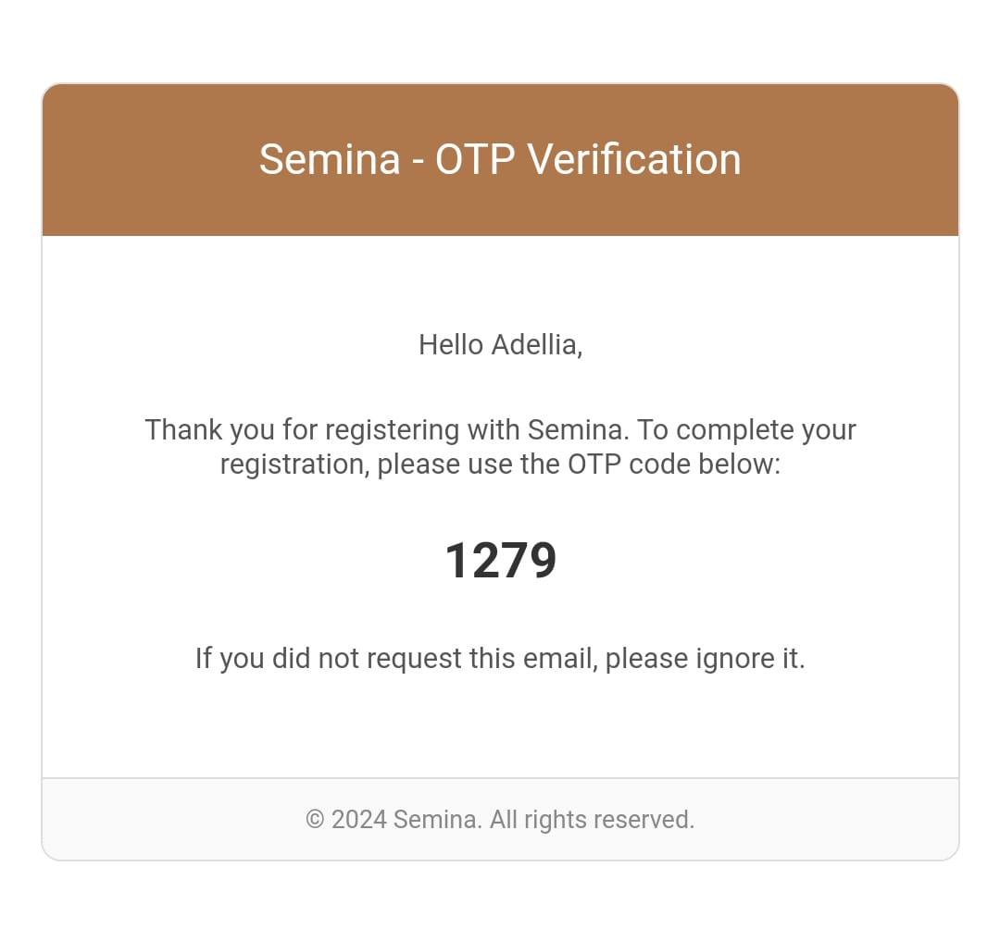
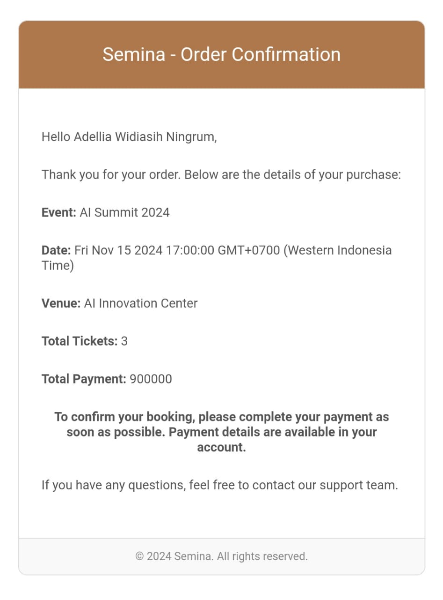

# Backend for an Event Ticket Booking Application

The backend is built with Express.js, the database is managed using the Mongoose, and authentication is implemented with JsonWebToken. It includes mailing features for OTP registration and order notifications using Nodemailer and Mustache.

## Run Locally

Clone the project

```bash
  git clone https://github.com/faukiofficial/event-ticket-booking-backend.git
```

Go to the project directory

```bash
  cd server
```

Install dependencies

```bash
  npm install
```

Start the server

```bash
  npm start
```


## Environment Variables

To run this project, you will need to add the following environment variables to your .env file

`NODE_ENV`

`PORT`

`MONGODB_URL`

`JWT_SECRET`

`JWT_EXPIRES_IN`

`SMTP_HOST`

`SMTP_PORT`

`SMTP_SERVICE`

`SMTP_MAIL`

`SMTP_PASSWORD`

## API Reference

### Events Endpoints

### 1. **Create Event**
**POST** `/api/events/create`

Creates a new event.

#### Request Body
```json
{
  "title": "AI Summit 2024",
  "date": "2024-11-15T10:00:00.000Z",
  "about": "A premier event for artificial intelligence professionals and enthusiasts.",
  "tagline": "Transforming Tomorrow with AI",
  "keyPoint": [
    "Exclusive AI demos",
    "Inspirational talks",
    "Advanced technical workshops"
  ],
  "vanueName": "AI Innovation Center",
  "statusEvent": "Published",
  "tickets": [
    {
      "type": "Platinum",
      "price": 300000,
      "stock": 30,
      "statusTicketCategories": true,
      "expiredDate": "2024-11-14T23:59:59.000Z"
    },
    {
      "type": "Standard",
      "price": 150000,
      "stock": 150,
      "statusTicketCategories": true,
      "expiredDate": "2024-11-14T23:59:59.000Z"
    }
  ],
  "image": "675be5edfa8aefbfebbfac26",
  "talent": "675be8514cb4611902374691",
  "category": "67592823e7dba9621b78827d"
}
```

#### Response
```json
{
    "success": true,
    "message": "Event created successfully",
    "event": {
        "title": "AI Summit 2024",
        "date": "2024-11-15T10:00:00.000Z",
        "about": "A premier event for artificial intelligence professionals and enthusiasts.",
        "tagline": "Transforming Tomorrow with AI",
        "keyPoint": [
            "Exclusive AI demos",
            "Inspirational talks",
            "Advanced technical workshops"
        ],
        "vanueName": "AI Innovation Center",
        "statusEvent": "Published",
        "tickets": [
            {
                "type": "Platinum",
                "price": 300000,
                "stock": 30,
                "statusTicketCategories": true,
                "expiredDate": "2024-11-14T23:59:59.000Z",
                "_id": "675bea3a138ac38c98e0a08b",
                "createdAt": "2024-12-13T08:03:06.443Z",
                "updatedAt": "2024-12-13T08:03:06.443Z"
            },
            {
                "type": "Standard",
                "price": 150000,
                "stock": 150,
                "statusTicketCategories": true,
                "expiredDate": "2024-11-14T23:59:59.000Z",
                "_id": "675bea3a138ac38c98e0a08c",
                "createdAt": "2024-12-13T08:03:06.443Z",
                "updatedAt": "2024-12-13T08:03:06.443Z"
            }
        ],
        "image": "675be5edfa8aefbfebbfac26",
        "talent": "675be8514cb4611902374691",
        "category": "67592823e7dba9621b78827d",
        "organizer": "6759317c32fc88628ffcc9c6",
        "_id": "675bea3a138ac38c98e0a08a",
        "createdAt": "2024-12-13T08:03:06.444Z",
        "updatedAt": "2024-12-13T08:03:06.444Z",
        "__v": 0
    }
}
```

---

### 2. **Get All Events**
**GET** `/api/events/get-all`

Retrieves a list of events.

#### Query Parameters
- `keyword`: Filter by keyword in title (Optional)
- `category`: Filter by category (Optional)
- `talent`: Filter by talent (Optional)

#### Response
```json
{
    "success": true,
    "message": "Events fetched successfully",
    "events": [
        {
            "_id": "675872e786ab75d734b90703",
            "title": "Tech Conference 2024",
            "date": "2024-12-20T09:00:00.000Z",
            "about": "A conference for technology enthusiasts.",
            "tagline": "Innovating the Future",
            "keyPoint": [
                "Networking opportunities",
                "Keynote speeches",
                "Hands-on workshops"
            ],
            "vanueName": "Grand Tech Hall",
            "statusEvent": "Published",
            "tickets": [
                {
                    "type": "VIP",
                    "price": 200000,
                    "stock": 82,
                    "statusTicketCategories": true,
                    "expiredDate": "2024-12-19T23:59:59.000Z",
                    "_id": "675872e786ab75d734b90704",
                    "createdAt": "2024-12-10T16:57:11.478Z",
                    "updatedAt": "2024-12-13T07:31:04.011Z"
                },
                {
                    "type": "General Admission",
                    "price": 100000,
                    "stock": 200,
                    "statusTicketCategories": true,
                    "expiredDate": "2024-12-19T23:59:59.000Z",
                    "_id": "675872e786ab75d734b90705",
                    "createdAt": "2024-12-10T16:57:11.478Z",
                    "updatedAt": "2024-12-10T16:57:11.478Z"
                }
            ],
            "image": {
                "_id": "675844f6ec5a7cd9eafd5d8b",
                "url": "/uploads/1733838070548-adellia.jpg"
            },
            "talent": {
                "_id": "675862e98a2b74cc132b542e",
                "name": "Adellia Widiasi Ningrum",
                "role": "Speaker",
                "image": {
                    "_id": "675844f6ec5a7cd9eafd5d8b",
                    "url": "/uploads/1733838070548-adellia.jpg"
                }
            },
            "category": {
                "_id": "6759332332fc88628ffcc9d2",
                "name": "Seminar 2"
            },
            "createdAt": "2024-12-10T16:57:11.479Z",
            "updatedAt": "2024-12-13T07:31:04.011Z",
            "__v": 0,
            "organizer": "6759317c32fc88628ffcc9c6"
        },
        {
            "_id": "675bea3a138ac38c98e0a08a",
            "title": "AI Summit 2024",
            "date": "2024-11-15T10:00:00.000Z",
            "about": "A premier event for artificial intelligence professionals and enthusiasts.",
            "tagline": "Transforming Tomorrow with AI",
            "keyPoint": [
                "Exclusive AI demos",
                "Inspirational talks",
                "Advanced technical workshops"
            ],
            "vanueName": "AI Innovation Center",
            "statusEvent": "Published",
            "tickets": [
                {
                    "type": "Platinum",
                    "price": 300000,
                    "stock": 30,
                    "statusTicketCategories": true,
                    "expiredDate": "2024-11-14T23:59:59.000Z",
                    "_id": "675bea3a138ac38c98e0a08b",
                    "createdAt": "2024-12-13T08:03:06.443Z",
                    "updatedAt": "2024-12-13T08:03:06.443Z"
                },
                {
                    "type": "Standard",
                    "price": 150000,
                    "stock": 150,
                    "statusTicketCategories": true,
                    "expiredDate": "2024-11-14T23:59:59.000Z",
                    "_id": "675bea3a138ac38c98e0a08c",
                    "createdAt": "2024-12-13T08:03:06.443Z",
                    "updatedAt": "2024-12-13T08:03:06.443Z"
                }
            ],
            "image": {
                "_id": "675be5edfa8aefbfebbfac26",
                "url": "/uploads/1734075885099-CSSDasar.png"
            },
            "talent": {
                "_id": "675be8514cb4611902374691",
                "name": "Fauki Rijatul H",
                "role": "Web Developer",
                "image": {
                    "_id": "675be732d43ded2b5c5e4c59",
                    "url": "/uploads/1734076210361-profile-Ba_09_dC.jpg"
                }
            },
            "category": {
                "_id": "67592823e7dba9621b78827d",
                "name": "Seminar"
            },
            "organizer": "6759317c32fc88628ffcc9c6",
            "createdAt": "2024-12-13T08:03:06.444Z",
            "updatedAt": "2024-12-13T08:03:06.444Z",
            "__v": 0
        }
    ]
}
```

---

### 3. **Get Single Event**
**GET** `/api/events/get/:id`

Fetches details of a specific event by ID.

#### Path Parameters
- `id`: Event ID (Required)

---

### 4. **Update Event**
**PUT** `/api/events/update/:id`

Updates an existing event.

#### Path Parameters
- `id`: Event ID (Required)

#### Request and Response Body
(Same as **Create Event**)

---

### 5. **Delete Event**
**DELETE** `/api/events/delete/:id`

Deletes an event by ID.

#### Headers
- `Authorization`: Bearer token (Required)

#### Path Parameters
- `id`: Event ID (Required)

#### Response
```json
{
  "success": true,
  "message": "Event deleted successfully"
}
```

---

### 6. **Change Event Status**
**PUT** `/api/events/update-status/:id`

Updates the status of an event.

#### Path Parameters
- `id`: Event ID (Required)

#### Request Body
```json
{
  "statusEvent": "Published" // Either "Draft" or "Published"
}
```

#### Response
```json
{
  "success": true,
  "message": "Event status updated successfully",
  "event": {
    "statusEvent": "Published"
  }
}
```


---

### Participants Endpoints

### 1. **Register Participant**
**POST** `/api/participants/register`

Registers a new participant.

#### Request Body
```json
{
  "firstName": "Adellia",
  "lastName": "Widiasih Ningrum",
  "password": "12345678",
  "role": "string" // Optional
}
```

#### Response
```json
{
    "success": true,
    "message": "Participant registered and need to verify",
    "participant": {
        "firstName": "Adellia",
        "lastName": "Widiasih Ningrum",
        "email": "faukirijatulnew@gmail.com",
        "role": "-",
        "status": "inactive",
        "_id": "675bf33876617c3edb20a833",
        "createdAt": "2024-12-13T08:41:28.564Z",
        "updatedAt": "2024-12-13T08:41:28.564Z",
        "__v": 0
    }
}
```

#### Email OTP


---

### 2. **Verify Participant**
**POST** `/api/participants/verify`

Verifies a participant's account using the OTP sent via email.

#### Request Body
```json
{
    "email": "faukirijatulnew@gmail.com",
    "otp": "1279"
}
```

#### Response
```json
{
    "success": true,
    "message": "Participant verified successfully",
    "participant": {
        "_id": "675bf33876617c3edb20a833",
        "firstName": "Adellia",
        "lastName": "Widiasih Ningrum",
        "email": "faukirijatulnew@gmail.com",
        "role": "-",
        "status": "active",
        "createdAt": "2024-12-13T08:41:28.564Z",
        "updatedAt": "2024-12-13T08:43:50.696Z",
        "__v": 0
    }
}
```

---

### 3. **Login Participant**
**POST** `/api/participants/login`

Logs in a participant and returns a JWT token.

#### Request Body
```json
{
    "password": "12345678",
    "email": "faukirijatulnew@gmail.com"
}
```

#### Response
```json
{
    "success": true,
    "token": "string"
}
```

---

### 4. **Get Events**
**GET** `/api/participants/events`

Retrieves a list of published events.

#### Response
```json
{
    "success": true,
    "message": "Events fetched successfully",
    "events": [
        {
            "_id": "675872e786ab75d734b90703",
            "title": "Tech Conference 2024",
            "date": "2024-12-20T09:00:00.000Z",
            "vanueName": "Grand Tech Hall",
            "tickets": [
                {
                    "type": "VIP",
                    "price": 200000,
                    "stock": 82,
                    "statusTicketCategories": true,
                    "expiredDate": "2024-12-19T23:59:59.000Z",
                    "_id": "675872e786ab75d734b90704",
                    "createdAt": "2024-12-10T16:57:11.478Z",
                    "updatedAt": "2024-12-13T07:31:04.011Z"
                },
                {
                    "type": "General Admission",
                    "price": 100000,
                    "stock": 200,
                    "statusTicketCategories": true,
                    "expiredDate": "2024-12-19T23:59:59.000Z",
                    "_id": "675872e786ab75d734b90705",
                    "createdAt": "2024-12-10T16:57:11.478Z",
                    "updatedAt": "2024-12-10T16:57:11.478Z"
                }
            ],
            "image": {
                "_id": "675844f6ec5a7cd9eafd5d8b",
                "url": "/uploads/1733838070548-adellia.jpg",
                "createdAt": "2024-12-10T13:41:10.563Z",
                "updatedAt": "2024-12-10T13:41:10.563Z",
                "__v": 0
            },
            "category": {
                "_id": "6759332332fc88628ffcc9d2",
                "name": "Seminar 2",
                "organizer": "6759317c32fc88628ffcc9c6",
                "createdAt": "2024-12-11T06:37:23.161Z",
                "updatedAt": "2024-12-11T06:37:23.161Z",
                "__v": 0
            }
        },
        {
            "_id": "675bea3a138ac38c98e0a08a",
            "title": "AI Summit 2024",
            "date": "2024-11-15T10:00:00.000Z",
            "vanueName": "AI Innovation Center",
            "tickets": [
                {
                    "type": "Platinum",
                    "price": 300000,
                    "stock": 30,
                    "statusTicketCategories": true,
                    "expiredDate": "2024-11-14T23:59:59.000Z",
                    "_id": "675bea3a138ac38c98e0a08b",
                    "createdAt": "2024-12-13T08:03:06.443Z",
                    "updatedAt": "2024-12-13T08:03:06.443Z"
                },
                {
                    "type": "Standard",
                    "price": 150000,
                    "stock": 150,
                    "statusTicketCategories": true,
                    "expiredDate": "2024-11-14T23:59:59.000Z",
                    "_id": "675bea3a138ac38c98e0a08c",
                    "createdAt": "2024-12-13T08:03:06.443Z",
                    "updatedAt": "2024-12-13T08:03:06.443Z"
                }
            ],
            "image": {
                "_id": "675be5edfa8aefbfebbfac26",
                "url": "/uploads/1734075885099-CSSDasar.png",
                "createdAt": "2024-12-13T07:44:45.118Z",
                "updatedAt": "2024-12-13T07:44:45.118Z",
                "__v": 0
            },
            "category": {
                "_id": "67592823e7dba9621b78827d",
                "name": "Seminar",
                "organizer": "6759317c32fc88628ffcc9c6",
                "createdAt": "2024-12-11T05:50:27.218Z",
                "updatedAt": "2024-12-11T05:50:27.218Z",
                "__v": 0
            }
        }
    ]
}
```

---

### 5. **Get Single Event**
**GET** `/api/participants/event/:id`

Fetches details of a specific event by ID.

---

### 6. **Checkout**
**POST** `/api/participants/checkout`

Places an order for an event.

#### Request Body
```json
{
    "event": "675bea3a138ac38c98e0a08a",
    "personalDetail": {
        "firstName": "Adellia",
        "lastName": "Widiasih Ningrum",
        "email": "faukirijatulnew@gmail.com",
        "role": "Web Developer"
    },
    "payment": "675aa6fc4c74c06c552869b4",
    "tickets": [
        {
        "ticketCategories": {
            "type": "Platinum",
            "price": 300000
        },
        "sumTicket": 3
    }
    ]
}
```

#### Response
```json
{
    "success": true,
    "message": "Order placed",
    "order": {
        "date": "2024-12-13T08:52:51.273Z",
        "personalDetail": {
            "firstName": "Adellia",
            "lastName": "Widiasih Ningrum",
            "email": "faukirijatulnew@gmail.com",
            "role": "Web Developer"
        },
        "status": "pending",
        "totalPay": 900000,
        "totalOrderTicket": 3,
        "orderItems": [
            {
                "ticketCategories": {
                    "type": "Platinum",
                    "price": 300000
                },
                "sumTicket": 3,
                "_id": "675bf5e376617c3edb20a85e"
            }
        ],
        "participant": "675bf33876617c3edb20a833",
        "payment": "675aa6fc4c74c06c552869b4",
        "event": "675bea3a138ac38c98e0a08a",
        "historyEvent": {
            "title": "AI Summit 2024",
            "date": "2024-11-15T10:00:00.000Z",
            "about": "A premier event for artificial intelligence professionals and enthusiasts.",
            "tagline": "Transforming Tomorrow with AI",
            "keyPoint": [
                "Exclusive AI demos",
                "Inspirational talks",
                "Advanced technical workshops"
            ],
            "vanueName": "AI Innovation Center",
            "tickets": [
                {
                    "type": "Platinum",
                    "price": 300000,
                    "stock": 24,
                    "statusTicketCategories": true,
                    "expiredDate": "2024-11-14T23:59:59.000Z",
                    "_id": "675bf5e376617c3edb20a85f",
                    "createdAt": "2024-12-13T08:52:51.286Z",
                    "updatedAt": "2024-12-13T08:52:51.286Z"
                },
                {
                    "type": "Standard",
                    "price": 150000,
                    "stock": 150,
                    "statusTicketCategories": true,
                    "expiredDate": "2024-11-14T23:59:59.000Z",
                    "_id": "675bf5e376617c3edb20a860",
                    "createdAt": "2024-12-13T08:52:51.286Z",
                    "updatedAt": "2024-12-13T08:52:51.286Z"
                }
            ],
            "image": "675be5edfa8aefbfebbfac26",
            "talent": "675be8514cb4611902374691",
            "category": "67592823e7dba9621b78827d",
            "organizer": "6759317c32fc88628ffcc9c6"
        },
        "_id": "675bf5e376617c3edb20a85d",
        "createdAt": "2024-12-13T08:52:51.287Z",
        "updatedAt": "2024-12-13T08:52:51.287Z",
        "__v": 0
    }
}
```

#### Email Notification


---

### 7. **Get Orders**
**POST** `/api/participants/orders`

#### Response

```json
{
    "success": true,
    "message": "Orders fetched successfully",
    "orders": [
        {
            "personalDetail": {
                "firstName": "Adellia",
                "lastName": "Widiasih Ningrum",
                "email": "faukirijatulnew@gmail.com@gmail.com",
                "role": "Web Developer"
            },
            "historyEvent": {
                "title": "AI Summit 2024",
                "date": "2024-11-15T10:00:00.000Z",
                "about": "A premier event for artificial intelligence professionals and enthusiasts.",
                "tagline": "Transforming Tomorrow with AI",
                "keyPoint": [
                    "Exclusive AI demos",
                    "Inspirational talks",
                    "Advanced technical workshops"
                ],
                "vanueName": "AI Innovation Center",
                "tickets": [
                    {
                        "type": "Platinum",
                        "price": 300000,
                        "stock": 27,
                        "statusTicketCategories": true,
                        "expiredDate": "2024-11-14T23:59:59.000Z",
                        "_id": "675bf49476617c3edb20a851",
                        "createdAt": "2024-12-13T08:47:16.340Z",
                        "updatedAt": "2024-12-13T08:47:16.340Z"
                    },
                    {
                        "type": "Standard",
                        "price": 150000,
                        "stock": 150,
                        "statusTicketCategories": true,
                        "expiredDate": "2024-11-14T23:59:59.000Z",
                        "_id": "675bf49476617c3edb20a852",
                        "createdAt": "2024-12-13T08:47:16.341Z",
                        "updatedAt": "2024-12-13T08:47:16.341Z"
                    }
                ],
                "image": "675be5edfa8aefbfebbfac26",
                "talent": "675be8514cb4611902374691",
                "category": "67592823e7dba9621b78827d",
                "organizer": "6759317c32fc88628ffcc9c6"
            },
            "_id": "675bf49476617c3edb20a84f",
            "date": "2024-12-13T08:47:16.326Z",
            "status": "pending",
            "totalPay": 900000,
            "totalOrderTicket": 3,
            "orderItems": [
                {
                    "ticketCategories": {
                        "type": "Platinum",
                        "price": 300000
                    },
                    "sumTicket": 3,
                    "_id": "675bf49476617c3edb20a850"
                }
            ],
            "participant": "675bf33876617c3edb20a833",
            "payment": "675aa6fc4c74c06c552869b4",
            "event": "675bea3a138ac38c98e0a08a",
            "createdAt": "2024-12-13T08:47:16.341Z",
            "updatedAt": "2024-12-13T08:47:16.341Z",
            "__v": 0
        }
    ]
}
```

